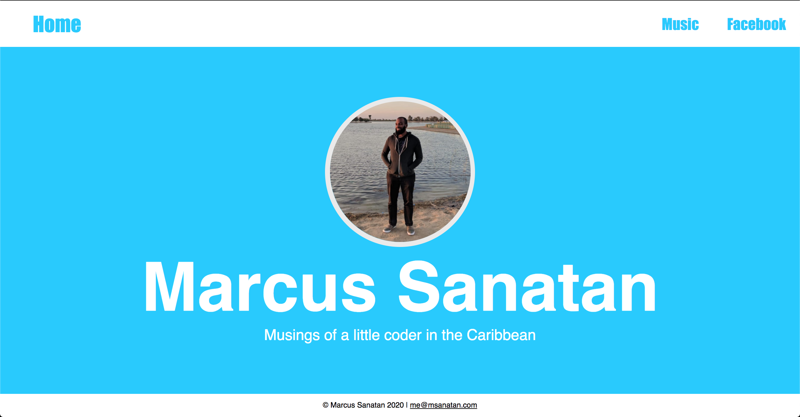

# Styling with CSS

Congrats on your progress so far! You've learned how to create webpages with different HTML elements, but they're a bit bland right now.

In this part of the course, we're going to learn how to style our web pages with CSS (Cascading Style Sheets).

CSS is a different language to HTML, but it's just as easy to learn. HTML says what to put on a website. CSS says how to display it. With CSS we'll learn how to change the colour of HTML elements and how we can place them. CSS is used heavily when create menus at the top of the page

At the end of this section, we'll have a website like this:

## How Will We Teach This Course

Unlike the previous section, every topic builds upon the work of the last. You're building one website, so you have to be sure you understand what you're working on

Let's get started by setting up our webpage