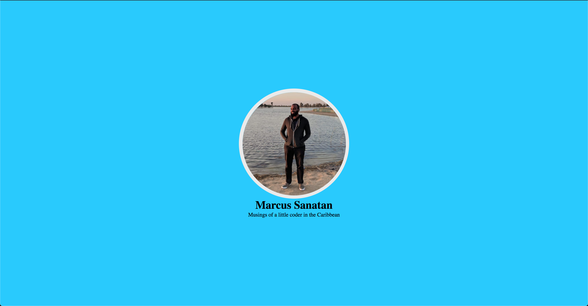

# Layout

What we're building?



We want to make better use of our space i.e. improve the layout of elements. CSS has many ways to define a layout. In this project, we'll utilize flexbox \- flexible boxes. The main idea is to tell the browser which direction we should position our HTML elements.

We'll use the flexbox layout to center our items on the page.

Let's begin with some changes to our HTML structure. Add a new `div` tag that's above the `div` with "main" as its ID. Give that new `div` a class called "container":

```html
<div class="container">
    <div id="main">
        
        <h1>Marcus Sanatan</h1>
        <p>Musings of a little coder in the Caribbean</p>
    </div>
</div>
```

Our `container` class is very important. When we define our flexbox properties in the container, the items directly below it become flex items.

Before we get to flexbox properties, we need to tell our browser that our two divs need to take up the entire space given to them. Change the style of `#main` to:

```css
#main {
    background-color: #11C9FF;
    width: 100%;
    height: 100%;
}
```

We're telling the browsers to take up the entire width and height available to the `div`. However, browsers usually work out the height by computing how much space our images and texts need. So we do a little trick to get it to take up the entire space.

Our container `div` comes right under the `body` and our container only contains another `div`. Browsers usually give such containers the **entire** height of the `body`. So let's add a new style for our container to make it large:

```css
/* This wraps around the site's contents */
.container {
    width: 100%;
    height: 100%;
}
```

Great! Our content takes up the entire page!

Now the next part, we want to our image and text in the centre of the page. It'll definitely look better there than in the top corner.

Let's begin by enabling the flex layout for our main `div`. Add this property to the `#main` CSS style:

```css
display: flex;
```

Congrats, we've just enabled the flexbox layout system! By default, items are layed out horizontally. We want to display our image and text one after the other. Let's change the direction of our flex items:

```css
flex-direction: column;
```

The `flex-direction` property indicates whether our items should be layed out from top to bottom or side to side. Since we want top to bottom, we use the `column` direction.

Not much has changed... but you're now ready to centre the items. Let's begin by putting our content in the middle horizontally:

```css
align-items: center;
```

The `align-items` property tells the browser how to display flex items on the *cross-axis*. What is the cross-axis? It's the line that's perpedicular to the *main-axis*. While full of jargon, it's easy to understand.

Our `flex-direction` is column, so our items are naturally aligned from top to bottom. In the cartesian plane, it would be like we're placing HTML elements up and down the y-axis. Therefore, `align-items` describes their position on the x-axis.

Likewise, if our `flex-direction` was row, indicating that we are laying out elements side to side, it would be like we're position items on the x-axis. Therefore, our `align-items` property would describe their layout the other way: on the y-axis.

To get it in the centre vertically we need to use a new property, `justify-content`:

```css
justify-content: center;
```

This property describes the position of items *on the main-axis* of the flex layout. So, as our `flex-direction` is column, it describes how the items are laid out vertically. If our `flex-direction` was row, it would describe how items are laid out horizontally.

Our website is taking shape! While our image pops up, our text is bland. Let's learn some font properties so we can make our words pop out a bit.
