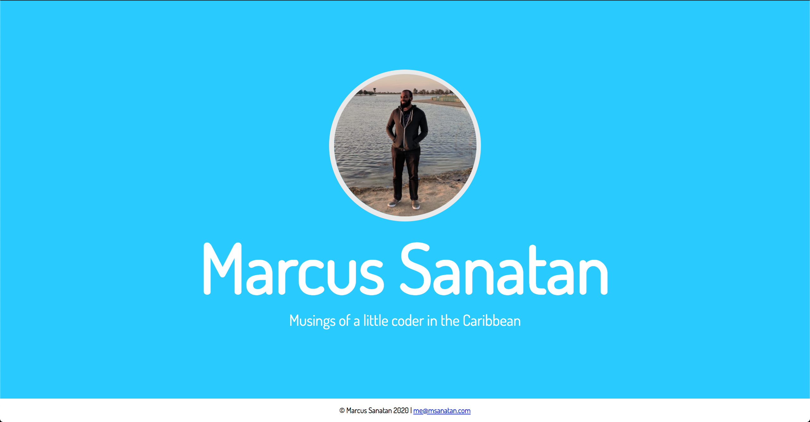

# Footer

What we're building?



Most websites have a footer, a division in your page that's at the bottom. Footers can be used, they provide a different visual outlet and can contain little useful bits of information like copyright or a link to your privacy policy.

Let's add a footer in our page that'll contain our copyright information. In your `index.html`, we'll add a *sibling element* after our main `div`. That means, we're adding content next to `#main`, and not inside it.

```html
<div class="container">
    <div id="main">
        <div class="banner">
            
            <h1>Marcus Sanatan</h1>
            <p>Musings of a little coder in the Caribbean</p>
        </div>
    </div>
    <footer>
        <p>&copy; Marcus Sanatan 2020 | <a href="mailto:me@msanatan.com">me@msanatan.com</a></p>
    </footer>
</div>
```

We use the special `footer` tag for our... footer... of course. There's nothing special about it visually, but it helps provide meaning to the page. A tool helping someone who's visually impaired will know that the content is part of the website's footer, and can relay the information differently with that knowledge.

Our `footer` tag contains one `p` tag. The `p` tag begins with `&copy;`. That bit of text is called a character reference. You can tell a character reference because it begins with `&` and ends with `;`. Character references are used to dispaly symbols that won't ordinarily appear on our keyboard or be formed with letters. `&copy;` displays the copyright symbol \- a "c" enclosed in a circle.

After our copyright text, we add a link to our email. To make a link to an email address, you need to begin the `href` value with `mailto:` and then enter your email address.

Our footer exists, but it looks horrendous if we leave it as is. Let's add some styling to it. In your `style` tag, add the following code to spruce up our footer:

```css
/* Our footer is simple, we add a minimum height so that it can be
easily seen on mobile devices too */
footer {
    min-height: 50px;
    background-color: #ffffff;
    font-family: Dosis, Helvetica, sans-serif;
    display: flex;
    align-items: center;
    justify-content: center;
}
```

Let's break down what's happening here:

* `min-height: 50px;` tells our browser that the footer must **at least** be 50px long. Therefore, if our content is small, the browser will add the extra space to fulfil this requirement
* `background-color: #ffffff;` makes our footer's background colour white. It's white by default, but it's always better to be explicit in case certain browsers have different defaults
* `font-family: Dosis, Helvetica, sans-serif;` sets the font for our text to use
* `display: flex; align-items: center; justify-content: center;` tells our browser that our footer is a flexbox. It then goes on to place the footer's contents vertically and horizontally in the middle

Much better, we've created a footer we can be proud of.

## A Better Footer

We got to scroll down to see our footer. That's fine. We only want our footer to be visible at the bottom of the page. But why do we have to scroll down? Well, we previously wanted to make the `#main` element take up the entire height and space of `.container`. We added our `footer` to the `.container`, however, there's no more space in the `.container` to show it. That's why we have to scroll down!

We should only need to scroll down if there's lots of content in our page, there isn't. How can we keep the `footer` in sight? There are many solutions to this problem. The cleanest one is to make `.container` a flexbox. Being a flexbox would force the browser to fit both elements into the container's height. Change your `.container` style to look like this:

```css
.container {
    width: 100%;
    height: 100%;
    display: flex;
    flex-direction: column;
}
```

And great! Our footer is visible at the bottom of the page as soon as we load it. No scrolling necessary!

Great job so far, your website is really taking shape. Now let's put our attention to the header of the site.

## Make It Your Own

Having practice with colours, flex positions and fonts - how can you improve on this simple footer?
