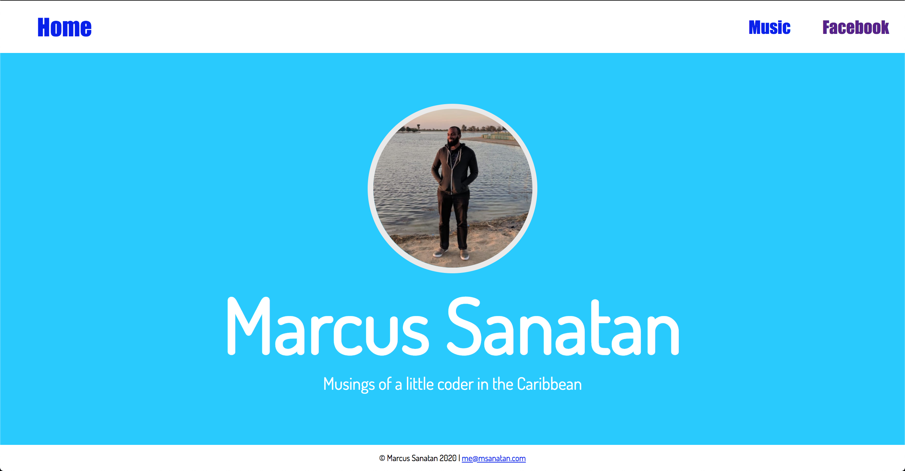

# Header

What we're building?



Most websites have headers as well \- a bar at the top of the page with that helps you navigate to other pages. The header is one of the first things a user sees, so make sure it's pretty and functional!

Let's build our header. It will have three buttons:

* One to the homepage
* Another for a music page we'll make later
* The last one for social media

All right, let's start by adding a header to our page! In `index.html` let's add a `header` tag at the top of our main `div` and just below our container:

```html
<div class="container">
    <header>
    </header>
    <div id="main">
```

Our `header` tag is as self-explanatory as the `footer` tag we used in the last lesson. It functions like a `div` in that its a container for other elements. However, while a `div` can be used for any part of the website, a `header` only makes sense to be used at the beginning of the content.

Now let's add our header buttons:

```html
<header>
    <nav class="navbar">
        <div class="nav-home">
            <a href="/" class="button home-button">Home</a>
        </div>
        <div class="nav-links">
            <a href="/music/" class="button">Music</a>
            <a href="https://www.facebook.com/msanatan" class="button" target="_blank">Facebook</a>
        </div>
    </nav>
</header>
```

We're seeing a new tag called `nav`. It's a container like `div` but it's meant to be used for navigation sections. Within our `nav` we have two `div`s: one for the "Home" button and another for the others. Why? Well we want to have the "Home" button on the left of the header while the other buttons will be on the right. This is easier to do when they're in separate containers.

The buttons in our header are `a` tags which link to another page. The "Home" button links to `/` which means *root* page. The "Music" button links to the `music` folder we'll create in a later lesson. By default, we can link to a folder once we create an `index.html` file inside of it. We then link to our social media page and add `target="_blank"` so that it opens in a new tab.

Our buttons are just regular links, they don't looks special at all. Matter of fact, our entire header looks very plan. Let's spruce things up a bit! In your `style` tag, first let's add a new font for tha will be used in our header:

```css
@font-face {
    font-family: 'Bebas Neueu';
    src: url('../fonts/bebas\ neue.ttf');
}
```

This font is a bold, sans-serif font that really jumps out from the rest of the page. We'll use it in our `nav` section as we add to our new `.navbar` style:

```css
.navbar {
    background-color: #ffffff;
    font-family: 'Bebas Neueu', Impact, Haettenschweiler, sans-serif;
    color: #11C9FF;
    display: flex;
    justify-content: space-between;
    align-items: center;
    width: 100%;
    height: 100%;
}
```

Note how we reference the "Bebas Neueu" font within quotes. You can use single or double quotes. You need to use quotes when the font name has a space between them. The `color` property ensures that any text in the section will the same colour as the main page.

We make it a flex container like the rest of the page, but this time `justify-content` is set to `space-between`. This ensures that our first item, the `.nav-home` div, is at the left of the box and our last item, the `.nav-links` div, is at the right of the box.

Let's make the navbar music and social media buttons line up horizontally:

```css
.nav-links {
    display: flex;
    flex-direction: row;
}
```

While `flex-direction` is set to `column`, items are placed one on top of each other. When they are set to `row`, they are placed next to each other.

Let's spruce up our buttons a bit. They're way too small for the screen size and they don't have any space between them.

```css
.button {
    padding: 30px;
    text-decoration: none;
    font-size: 32px;
}
```

The padding should give us some breathing room and the larger font-size definitely helps. When we set `text-decoration` to `none`, we remove the underline and all the usual behaviours of `a` tags i.e. links.

Finally, let's make the "Home" button a bit bigger and spacious:

```css
/* Give the home icon some space on the left */
.nav-home {
    padding-left: 40px;
}

/* Make the home button a bit bigger */
.home-button {
    font-size: 44px;
}
```

Much better! Our buttons are starting to shine a bit. However, the color is a bit drab. When we hover over them, nothing happens either. It'd be nice to know if we're going to click the right button. We'll style these with pseudo-classes.
