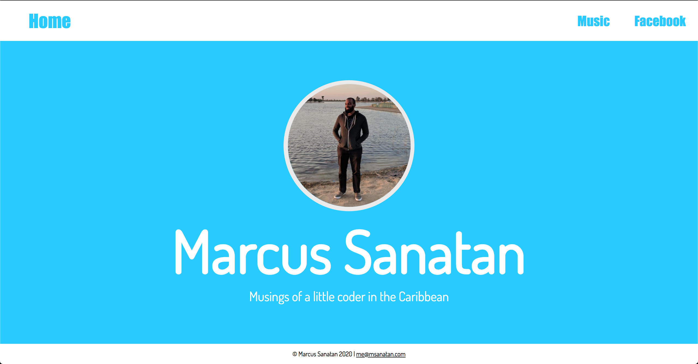

# Psuedo-Classes

What we're building?



A pseudo (meaning fake) class talks about the *state* of a CSS class. And what's their state? State could mean whether we're hovering over the object, or if we visited a link already.

Pseudo classes look a bit different from what we've seen before:

```plaintext
selector:pseudo-class {
  property:value;
}
```

They're most commonly used with `a` tags. We'll use it to get rid of it's strange purple colour, which most people do. Add this in the `style` tag:

```css
a,
a:visited,
a:hover,
a:active {
    color: inherit;
}
```

You added your first (few) pseudo-class! Let's look at each one:

- `visited` means that we've clicked on the link before
- `hover` means that our mouse is hovering over the link
- `active` means that we've clicked on the link

In our new code, we're telling the web browser that no matter how we interact with the link, only use the text colour that's inherited. The most recent text colour definition was in our `navbar` class, which makes all text blue like the colour of the main background.

Let's use pseudo-classes to make our buttons pop out with some colour when we hover over them:

```css
.button:hover {
    color: #ff9411;
    text-decoration: underline;
    text-decoration-color: #ff1d11;
}
```

When we over any item with the `button` class, currently everything in our navigation bar, we change its colour to orange. We also use `text-decoration` to underline the items. The `text-decoration` CSS rule can add an underline, overline or a line through some text. We then use the `text-decoration-color` text to make our underline red.

Now we hover over it, looks pretty good! Why don't we do the same for our email in the footer:

```css
footer a:hover {
    color: #ff9411;
    text-decoration-color: #ff1d11;
}
```

Nice, our page looks pretty good. I think we can put a pin on the homepage for now and set up our music page
