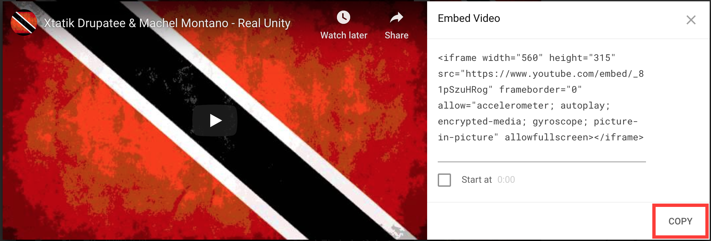

# Embedding Videos

Now that we set up our music page, let's add some music to it. We'll do this by placing our favourite YouTube videos on the page. We won't just add a link, we'll allow people visiting our website to play the videos too.

Before we start adding songs, let's give a clue to the user that this is a different page from the main page. Of course, when they see YouTube videos loading it will be obvious, but a little notice never hurts.

Right below the `content` div, let's add a heading:

```html
<div class="content">
    <div class="heading">
        <h2>Marcus' Playlist</h2>
    </div>
```

Now let's make it pop out the screen a bit with CSS. Add this to our `styles.css` file:

```css
.heading {
    padding: 20px;
    border-bottom: 5px solid #EAEAEA;
}

.heading h2 {
    font-size: 50px;
    text-transform: uppercase;
}
```

Now our page title is big and unmissable.

So let's move on to our YouTube songs. First go on <https://youtube.com> and search for your song. Select whichever one you want.

Now click on the share button


And then select the "embed" option


And now copy the code you see in the textbox:



Add that code into your `music/index.html` file.

Sweet, you've embedded your first YouTube video! We do this through the `iframe` tag. That tag loads another HTML file all together. You can load almost any other website on your own with an `iframe`.

I prefer to have two songs in a row for my website. So I'll add some changes on my end. I'll add a couple of divs:

```html
<div class="heading">
    <h2>Marcus' Playlist</h2>
</div>
<div class="songs">
    <div class="song">
        <iframe width="400" height="275" src="https://www.youtube.com/embed/_81pSzuHRog" frameborder="0"
            allow="accelerometer; autoplay; encrypted-media; gyroscope; picture-in-picture"
            allowfullscreen></iframe>
    </div>
    <div class="song">
        <iframe width="400" height="275" src="https://www.youtube.com/embed/9bx_r7H7eF8" frameborder="0"
            allow="accelerometer; autoplay; encrypted-media; gyroscope; picture-in-picture"
            allowfullscreen></iframe>
    </div>
</div>
```

Note how we created two new classes: `songs` which contains a row of songs and `song` which styles an individual song. I'll use the `flex` properties again to ensure each one fits in one row:

```css
.songs {
    padding: 40px 20px;
    display: flex;
    flex-direction: row;
    justify-content: center;
}

.song {
    margin: 0 10px;
    flex: 0.25;
}
```

Now that's perfect! Why don't add more of your own music?
